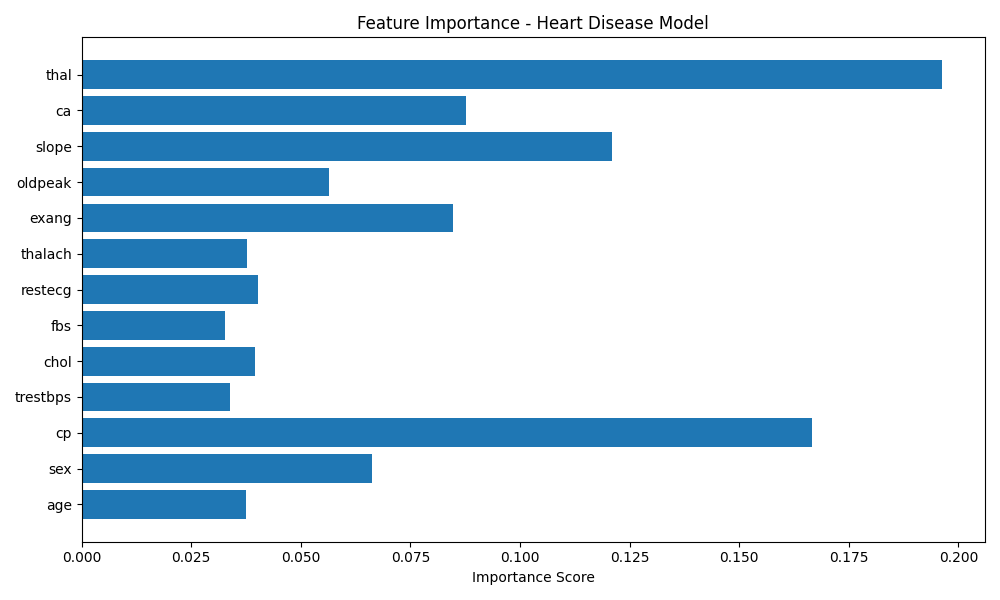

<div align="center">


# 🏥 Medlink AI

### An Integrated Health Monitoring & Diagnostic Support System

**One Flask web app with four health tools: heart-risk prediction · medical Q&A chatbot · lab-report analysis · nearby hospital finder**

[Overview](#-overview) • [Features](#-features) • [Architecture](#%EF%B8%8F-system-architecture) • [Installation](#%EF%B8%8F-installation) • [Usage](#-usage) • [API](#-api-reference) • [Model Performance](#-model-performance) • [Limitations](#%EF%B8%8F-known-limitations)

</div>

---

## 📖 Overview

Medlink AI is a full-stack healthcare assistance platform built with **Flask**. After signing in, a user can reach four AI-assisted modules from a single dashboard:

| Module | How it works | Route |
|--------|--------------|-------|
| 🫀 **Heart Disease Risk Predictor** | XGBoost classifier trained on the UCI Cleveland heart dataset (13 clinical features) | `/predict_page` |
| 🤖 **Medical Chatbot** | Semantic search with Sentence Transformers (`all-MiniLM-L6-v2`) over 10,000 real patient–doctor conversations | `/chatbot` |
| 📄 **Lab Report Analyzer** | Tesseract OCR + regex extraction of 9 biomarkers → rule-based, organ-wise risk score | `/report_page` |
| 📍 **Nearby Healthcare Finder** | Browser geolocation + OpenStreetMap Overpass API + Haversine distance, shown on a Leaflet map | `/nearby_page` |

> ⚠️ **Medical Disclaimer:** Medlink AI is an academic decision-support prototype. Its outputs are informational only and are **not** a substitute for diagnosis or advice from a qualified healthcare professional.

---

## ✨ Features

- 🔐 **User accounts**: registration and login with **bcrypt**-hashed passwords and **Flask-Login** sessions. Every module requires login.
- 🫀 **Cardiovascular risk prediction**: enter 13 clinical parameters to get a **Low / Moderate / High** risk label, a probability score and a plain-language explanation.
- 🤖 **Semantic medical chatbot**: ask a question in natural language and get the doctor's reply from the most similar patient question in the corpus. Low-confidence matches fall back to a safety message.
- 📄 **Lab report analysis**: upload a report image to get a structured summary covering CBC, metabolic panel and lipid profile, plus organ-system scores, an overall risk category and critical alerts.
- 📍 **Nearby hospitals and clinics**: search within 5, 10 or 20 km. The 20 nearest results appear on an interactive map, each with a one-click **Google Maps directions** link.
- 🛡️ **Admin panel**: users with the `admin` role can list all registered accounts.
- ⚡ **Lightweight**: runs on a laptop CPU with SQLite. No GPU or cloud services are required.

---

## 🖥️ Modules in Detail

### 🫀 1. Heart Disease Risk Predictor

The form collects the 13 standard UCI features:

| Field | Meaning | Values |
|-------|---------|--------|
| `age` | Age in years | number |
| `sex` | Sex | 1 = Male, 0 = Female |
| `cp` | Chest pain type | 0 Typical angina · 1 Atypical angina · 2 Non-anginal · 3 Asymptomatic |
| `trestbps` | Resting blood pressure (mm Hg) | number |
| `chol` | Serum cholesterol (mg/dl) | number |
| `fbs` | Fasting blood sugar > 120 mg/dl | 0 / 1 |
| `restecg` | Resting ECG | 0 Normal · 1 ST-T abnormality · 2 LV hypertrophy |
| `thalach` | Maximum heart rate achieved | number |
| `exang` | Exercise-induced angina | 0 / 1 |
| `oldpeak` | ST depression induced by exercise | number |
| `slope` | Slope of peak exercise ST segment | 0 Up · 1 Flat · 2 Down |
| `ca` | Major vessels colored by fluoroscopy | 0–3 |
| `thal` | Thalassemia | 1 Normal · 2 Fixed defect · 3 Reversible defect |

**Pipeline** ([utils/predictor.py](utils/predictor.py)): the input is scaled with the saved `StandardScaler`, then XGBoost returns `predict_proba`, and the probability is mapped to a risk band:

| Probability | Risk level |
|-------------|------------|
| `< 0.35` | 🟢 Low Risk |
| `0.35 – 0.65` | 🟠 Moderate Risk |
| `≥ 0.65` | 🔴 High Risk |

### 🤖 2. AI Medical Chatbot

- **Corpus:** 10,000 patient/doctor pairs randomly sampled (`random_state=42`) from the [ruslanmv/ai-medical-chatbot](https://huggingface.co/datasets/ruslanmv/ai-medical-chatbot) dataset (≈257k conversations).
- **Offline step** ([models/train_chatbot.py](models/train_chatbot.py)): every patient question is encoded with `all-MiniLM-L6-v2`. The questions, answers and embeddings are saved to `models/chatbot_model.pkl`.
- **At runtime** ([utils/chatbot.py](utils/chatbot.py)): the user's message is encoded and compared to all stored question embeddings by **cosine similarity**, and the doctor's answer for the best match is returned.
- **Safety fallback:** if the best similarity is **below 0.30**, the bot replies *"I'm not fully confident. Please consult a healthcare professional."*

### 📄 3. Medical Report Analyzer

[utils/report.py](utils/report.py) works in three steps:

1. **Text extraction**: `.png` / `.jpg` / `.jpeg` files go through **Tesseract OCR**. Any other file is read as UTF-8 plain text.
2. **Biomarker extraction** with case-insensitive regex (for example `Glucose: 145`).
3. **Rule-based scoring**: each abnormal value adds points to its organ system and to the overall score.

| Panel | Biomarker | Rule → points |
|-------|-----------|---------------|
| CBC | Hemoglobin (g/dL) | < 10 → 15 ⚠️ critical · < 12 → 8 |
| CBC | WBC (/µL) | > 11,000 → 5 |
| CBC | Platelets (/µL) | < 150,000 → 6 ⚠️ critical |
| Metabolic | Fasting glucose (mg/dL) | ≥ 200 → 20 ⚠️ critical · ≥ 126 → 12 · ≥ 100 → 6 |
| Metabolic | HbA1c (%) | ≥ 6.5 → 10 |
| Renal | Creatinine (mg/dL) | > 1.5 → 12 ⚠️ critical |
| Cardiovascular | Total cholesterol (mg/dL) | > 240 → 12 · > 200 → 6 |
| Cardiovascular | LDL (mg/dL) | > 160 → 8 |
| Cardiovascular | HDL (mg/dL) | < 40 → 5 |

**Overall category:** `< 15` Low · `15–34` Moderate · `≥ 35` High. The response also includes per-organ scores (Hematology, Metabolic, Cardiovascular, Renal), interpretation text and a list of critical alerts.

### 📍 4. Nearby Healthcare Finder

1. The browser asks for the user's location (`navigator.geolocation`).
2. [utils/location.py](utils/location.py) builds an **Overpass QL** query for `amenity=hospital` and/or `amenity=clinic` nodes, ways and relations within the chosen radius. It tries `overpass-api.de` first and falls back to the `lz4` mirror.
3. Results are ranked by **Haversine** distance in km, and the 20 nearest are returned.
4. The page plots them on a **Leaflet** + OpenStreetMap map, with a list of names, distances and Google Maps directions links.

---

## 🏛️ System Architecture

```
┌──────────────────────────────────────────────────────────────────┐
│                         BROWSER (Jinja2 pages)                   │
│  login · register · dashboard · chatbot · predict · report ·     │
│  nearby (Leaflet map) · admin           HTML / CSS / vanilla JS  │
└───────────────────────────────┬──────────────────────────────────┘
                                │  form posts + fetch() JSON calls
┌───────────────────────────────▼──────────────────────────────────┐
│                       FLASK APP  (app.py)                        │
│  Flask-Login sessions · bcrypt auth · route handlers             │
└──────┬──────────────────┬───────────────────┬───────────────┬────┘
       │                  │                   │               │
┌──────▼───────┐  ┌───────▼───────┐  ┌────────▼──────┐  ┌─────▼────────────┐
│ chatbot.py   │  │ predictor.py  │  │ report.py     │  │ location.py      │
│ MiniLM-L6-v2 │  │ StandardScaler│  │ Tesseract OCR │  │ Overpass API     │
│ cosine sim   │  │ + XGBoost     │  │ regex + rules │  │ Haversine sort   │
└──────┬───────┘  └───────┬───────┘  └────────┬──────┘  └─────┬────────────┘
       │                  │                   │               │
┌──────▼──────────────────▼───────────────────▼───────────────▼────┐
│  DATA: models/chatbot_model.pkl · models/heart_disease_model.pkl │
│        instance/database.db (SQLite users) · uploads/            │
└──────────────────────────────────────────────────────────────────┘
```

---

## 🛠️ Tech Stack

| Layer | Technology |
|-------|-----------|
| Backend | Flask, Flask-SQLAlchemy, Flask-Login |
| Auth | bcrypt password hashing, session-based login, role field (`user` / `admin`) |
| Database | SQLite (`instance/database.db`) |
| Heart model | XGBoost, scikit-learn (`StandardScaler`, CV, metrics), pandas, NumPy |
| Chatbot | sentence-transformers (`all-MiniLM-L6-v2`), PyTorch |
| OCR | Tesseract via `pytesseract`, Pillow |
| Geolocation | OpenStreetMap Overpass API (`requests`), Haversine formula |
| Frontend | Jinja2 templates, HTML5/CSS3, vanilla JavaScript, Leaflet.js, Google Fonts (Poppins), Font Awesome |
| Serialization | joblib |

---

## 📁 Project Structure

```
final web/
├── app.py                       # Flask app: config, User model, all routes
├── config.py                    # SECRET_KEY, DB URI, upload folder
├── requirements.txt
│
├── utils/
│   ├── chatbot.py               # Sentence-Transformer semantic retrieval
│   ├── predictor.py             # Heart-disease inference + risk banding
│   ├── report.py                # OCR + biomarker extraction + risk scoring
│   └── location.py              # Overpass query + Haversine ranking
│
├── models/
│   ├── train_heart_model.py     # Trains XGBoost → heart_disease_model.pkl
│   ├── train_chatbot.py         # Encodes Q&A corpus → chatbot_model.pkl
│   ├── heart.csv                # UCI Cleveland heart dataset (303 rows)
│   ├── heart_disease_model.pkl  # {"model": XGBClassifier, "scaler": StandardScaler}
│   ├── chatbot_model.pkl        # (questions, answers, embeddings)
│   └── feature_importance.png   # Generated by the training script
│   # ai-medical-chatbot.csv     # Not committed (≈267 MB) – see "Retraining"
│
├── templates/                   # Jinja2 pages
│   ├── base.html                # Bootstrap base layout (used by admin)
│   ├── login.html · register.html · dashboard.html · admin.html
│   └── chatbot.html · predict.html · report.html · nearby.html
│
├── static/
│   ├── css/style.css
│   └── js/main.js
│
├── instance/database.db         # SQLite DB (created automatically)
└── uploads/                     # Uploaded reports are saved here
```

---

## ⚙️ Installation

### Prerequisites

- **Python 3.10** (the project was developed on 3.10.11)
- **Tesseract OCR**, needed by the report analyzer

```bash
# Windows: run the installer from https://github.com/UB-Mannheim/tesseract/wiki
#          (default path: C:\Program Files\Tesseract-OCR\tesseract.exe)
# macOS
brew install tesseract
# Ubuntu / Debian
sudo apt-get install tesseract-ocr
```

### Setup

```bash
# 1. Clone the repository
git clone https://github.com/harjassunejagit/Medlink-AI-An-Integrated-Health-Monitoring-and-Diagnostic-Support-System.git
cd Medlink-AI-An-Integrated-Health-Monitoring-and-Diagnostic-Support-System

# 2. Create and activate a fresh virtual environment
python -m venv .venv
# Windows
.venv\Scripts\activate
# macOS / Linux
source .venv/bin/activate

# 3. Install dependencies
pip install -r requirements.txt
pip install sentence-transformers xgboost   # also required at runtime (pulls in PyTorch)
pip install matplotlib                      # only needed to retrain the heart model

# 4. Run the app (creates the SQLite tables on first launch)
python app.py
```

Open **http://127.0.0.1:5000**, create an account on the register page, and log in.

> 💡 The first launch downloads the `all-MiniLM-L6-v2` model (~90 MB) from Hugging Face, so it needs an internet connection.

> 🐧 **macOS / Linux users:** [utils/report.py](utils/report.py) hard-codes the Windows Tesseract path. Change that line to your own path (for example `/usr/bin/tesseract`), or delete it if `tesseract` is already on your `PATH`.

### Making a user an admin

There is no UI for assigning roles yet. To promote an account after registering it, run:

```bash
python -c "import sqlite3; c=sqlite3.connect('instance/database.db'); c.execute(\"UPDATE user SET role='admin' WHERE email='you@example.com'\"); c.commit()"
```

That user can then open `/admin`.

### Configuration

All settings are in [config.py](config.py):

| Key | Default | Notes |
|-----|---------|-------|
| `SECRET_KEY` | `"supersecret"` | **Change this** before deploying anywhere |
| `SQLALCHEMY_DATABASE_URI` | `sqlite:///database.db` | Flask-SQLAlchemy stores it in `instance/` |
| `UPLOAD_FOLDER` | `uploads` | Created automatically if missing |
| `GOOGLE_API_KEY` | placeholder | Not used by the current code |

---

## 🔁 Retraining the Models

The trained models are already committed, so this step is optional. Both scripts use relative paths, so run them from inside `models/`.

**Heart disease model**

```bash
cd models
python train_heart_model.py   # prints CV + test metrics, writes heart_disease_model.pkl and feature_importance.png
```

**Chatbot embeddings**

1. Download `ai-medical-chatbot.csv` from [ruslanmv/ai-medical-chatbot](https://huggingface.co/datasets/ruslanmv/ai-medical-chatbot) and place it in `models/`. It needs the `Patient` and `Doctor` columns.
2. Run:
   ```bash
   cd models
   python train_chatbot.py       # samples 10,000 pairs, encodes them, writes chatbot_model.pkl
   ```

---

## 🚀 Usage

| Step | What to do |
|------|------------|
| 1 | Register at `/register`, then log in at `/` |
| 2 | The **dashboard** links to every module (its health snapshot cards are static demo content for now) |
| 3 | **❤️ Heart Risk**: fill in the 13 fields → *Predict* → risk level, confidence bar and explanation |
| 4 | **🤖 AI Chatbot**: type a question such as *"What are the symptoms of high blood pressure?"* |
| 5 | **📊 Report Analysis**: upload a lab-report image (PNG/JPG) or a `.txt` report → score, category and detailed breakdown |
| 6 | **🏥 Nearby Hospitals**: allow location access, pick a radius and facility type → map + list with directions |

---

## 📡 API Reference

All endpoints below need a logged-in session cookie.

| Method | Endpoint | Body | Response |
|--------|----------|------|----------|
| `POST` | `/register` | form: `username`, `email`, `password` | redirect to `/` |
| `POST` | `/login` | form: `email`, `password` | redirect to `/dashboard` |
| `GET` | `/logout` | – | redirect to `/` |
| `POST` | `/chat` | `{"message": "..."}` | `{"response": "..."}` |
| `POST` | `/predict` | JSON with the 13 feature keys | `{"prediction", "confidence_percentage", "probability_score", "explanation"}` |
| `POST` | `/analyze_report` | multipart `file` | `{"detailed_report", "overall_score", "risk_category"}` |
| `POST` | `/nearby` | `{"lat", "lng", "radius": 5\|10\|20, "hospital_type": "all"\|"hospital"\|"clinic"}` | `[{"name", "latitude", "longitude", "distance"}, ...]` |
| `GET` | `/admin` | – | user list (admin role only) |

<details>
<summary>Example: <code>/predict</code></summary>

```json
// Request
{ "age": 63, "sex": 1, "cp": 3, "trestbps": 145, "chol": 233, "fbs": 1,
  "restecg": 0, "thalach": 150, "exang": 0, "oldpeak": 2.3, "slope": 0, "ca": 0, "thal": 1 }

// Response
{ "prediction": "Low Risk", "confidence_percentage": 15.72, "probability_score": 0.1572,
  "explanation": "Cardiovascular parameters fall within relatively safe clinical ranges." }
```
</details>

---

## 📊 Model Performance

### Heart Disease Predictor (XGBoost)

**Training setup:** 303 samples, stratified 80/20 split (`random_state=42`), so the held-out test set has **61 patients**. Features are scaled with `StandardScaler`. Model settings: `n_estimators=300, max_depth=4, learning_rate=0.05, subsample=0.8, colsample_bytree=0.8`.

| Metric | Committed model (`heart_disease_model.pkl`) | Fresh retrain* |
|--------|------|------|
| Test accuracy | **82.0%** | 80.3% |
| ROC-AUC | **0.86** | 0.87 |
| 5-fold CV accuracy (train set) | – | 0.81 ± 0.07 |
| Precision / Recall / F1 | – | 0.76 / 0.94 / 0.84 |

<sub>*Measured by re-running `train_heart_model.py` with XGBoost 2.0.3 and scikit-learn 1.5.0. Exact numbers can shift slightly between library versions. With only 61 test samples, each misclassification moves accuracy by about 1.6 percentage points.</sub>

**Most important features (retrain):** `thal` (0.20) · `cp` chest-pain type (0.17) · `slope` (0.11) · `ca` major vessels (0.09) · `exang` (0.09)

<div align="center">

</div>

### Chatbot

- **Retrieval-based:** it returns real physician answers from the corpus and never generates new text.
- **Confidence threshold:** cosine similarity of 0.30. Below that, the bot gives a safe fallback reply.
- **Coverage:** 10,000 of ≈257k available conversations are indexed. Indexing more improves recall but makes the `.pkl` larger.

---

## ⚠️ Known Limitations

- **Small heart dataset:** 303 patients from a single source, so the model generalises poorly to other populations.
- **No PDF support in the report analyzer:** only images and plain-text files are handled. A PDF upload will error out.
- **OCR quality:** results depend on scan quality. Handwritten or low-resolution reports may lose values, and the regexes expect `Name: value` formatting.
- **Platform-specific Tesseract path:** the path is hard-coded for Windows (see Installation).
- **Static dashboard:** the snapshot, trend and recommendation cards show placeholder data and are not yet linked to the user's history.
- **"Emergency Centers" filter:** this option currently returns the same results as "All Healthcare".
- **Prototype security:** the secret key is hard-coded, `debug=True` is on, and uploaded filenames are not sanitised. Harden all of these before any real deployment.
- **No clinical validation:** never use this tool for real diagnosis.

---

## 🗺️ Roadmap

- [ ] PDF support in the report analyzer (`pdf2image` / `pdfplumber`)
- [ ] Persist predictions and reports per user and drive the dashboard from real history
- [ ] Admin UI for role management and usage statistics
- [ ] Cross-platform Tesseract detection and environment-based configuration (`.env`)
- [ ] Larger chatbot index and multi-language support
- [ ] More biomarkers (triglycerides, thyroid panel, liver enzymes, troponin)
- [ ] Docker image and cloud deployment
- [ ] Mobile-friendly PWA

---

## 🤝 Contributing

Contributions are welcome!

1. Fork the repository
2. Create a feature branch: `git checkout -b feature/your-feature`
3. Commit your changes: `git commit -m "Add your feature"`
4. Push the branch: `git push origin feature/your-feature`
5. Open a Pull Request

Please don't commit virtual environments, `__pycache__/`, large datasets, or anything with personal or medical information.

---

## 👨‍💻 Author

**Harjas Suneja** · [GitHub @harjassunejagit](https://github.com/harjassunejagit)

<div align="center">

⭐ If you found this project useful, consider giving it a star!

</div>
